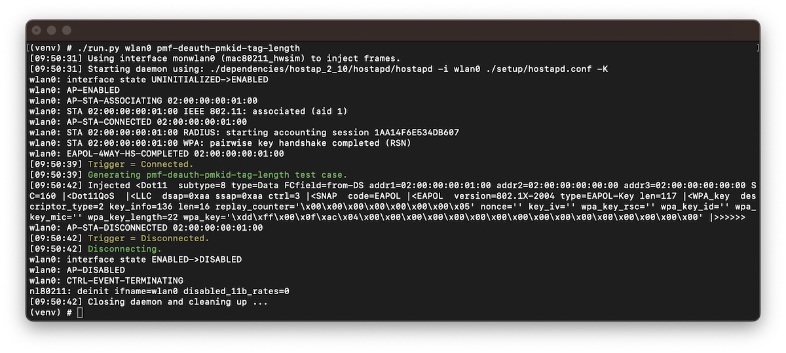

# Wi-Fi Deauthentication

In this repository, we present deauthentication techniques bypassing Wi-Fi Management Frame Protection ([pdf](https://papers.mathyvanhoef.com/wisec2022.pdf)).

The identified vulnerabilities lead to denial-of-service and network disruptions, and can help an adversary to execute other attacks (for example, when the adversary requires the execution of a new handshake).

#### Wi-Fi Management Frame Protection

Wi-Fi Management Frame Protection (MFP), defined in IEEE 802.11w, protects robust management frames by providing data confidentiality, integrity, origin authenticity, and replay protection.
One of its key goals is to prevent deauthentication attacks in which an adversary forcibly disconnects a client from the network.

## Vulnerabilities

We identified the following vulnerabilities, disconnecting the client and access point.

#### 4-Way Handshake 

| Vulnerability | hostap-2.9 | hostap-2.10 | iwd-1.27 |
| :--- | :---: | :---: | :---: |
| Corrrupt 4-Way Handshake Message 1/4 | :heavy_check_mark: | :heavy_check_mark: | :heavy_check_mark: |

| Vulnerability | Android 12 |
| :--- | :---: |
| Incorrect IGTK Installation | :heavy_check_mark: |

#### IEEE 802.1X Authentication

| Vulnerability | hostap-2.9 | hostap-2.10 | iwd-1.27 |
| :--- | :---: | :---: | :---: |
| EAPoL Logoff | :heavy_check_mark: | :heavy_check_mark: | |
| EAP Failure | :heavy_check_mark: | :heavy_check_mark: | :heavy_check_mark:<sup>1 |
| Maximum Number of EAP Rounds | :heavy_check_mark: | :heavy_check_mark: | |
| Maximum Number of Re-Authentications | :heavy_check_mark: | :heavy_check_mark: | |

<sup>1</sup> Also successful against personal network configurations such as WPA3-Personal.

#### MLME Processing

| Vulnerability | Linux 5.15.0 | macOS 12.3 | iOS 15.4 |
| :--- | :---: | :---: | :---: |
| Invalid Channel Switch Announcement | :heavy_check_mark: | :heavy_check_mark: | :heavy_check_mark: |
| Unsupported Bandwidth Change | :heavy_check_mark: | | |

## Proof-of-Concepts

As proof-of-concepts we provide [test cases](framework/test-deauthentication.py) for the [Wi-Fi Framework](https://github.com/domienschepers/wifi-framework) (see [usage instructions](https://github.com/domienschepers/wifi-framework/blob/master/docs/USAGE.md)).

Note that not all proof-of-concepts are available due to ongoing disclosures and security updates.

As an example, we provide instructions for the `pmf-deauth-pmkid-tag-length` [test case](framework/test-deauthentication.py).

#### Configuration

Using the Wi-Fi Framework, start two virtual radio interfaces:

```
./setup/setup-hwsim.sh
```

Then load the appropriate network configuration to use WPA3-Personal with Management Frame Protection (MFP):

```
cd setup; ./load-config.sh wpa3-personal-pmf
```

#### Run the Wi-Fi Framework Test Case

Start the access point which will execute the `pmf-deauth-pmkid-tag-length` test case:

```
./run.py wlan0 pmf-deauth-pmkid-tag-length
```

Finally, we can connect a client with the access point, which will initiate the attack:

```
./hostap.py wlan1
```

After successful execution, the test case will detect the protected deauthentication frame from the client.

<p align="center">
	
	<br />
	<em>Example output for the invalid PMKID Tag Length using Linux 5.15.0 and hostap 2.10.</em>
</p>

#### Patch

The following commit in hostap discards corrupted messages:

- [WPA: Discard EAPOL-Key msg 1/4 with corrupted information elements](https://w1.fi/cgit/hostap/commit/?id=b1172c19e1900d478f98437fdf8114a5d5a81b0c)

#### Network Capture

In [example-pmf-deauth-pmkid-tag-length.pcapng](framework/example-pmf-deauth-pmkid-tag-length.pcapng), we provide a network capture demonstrating the attack.

- Frame 34: Spoofed handshake frame which contains the corrupted RSN PMKID tag length.
- Frame 36: The victim client transmits a protected deauthentication frame.

## Security Updates and Patches

The [Pixel Update Bulletin](https://source.android.com/docs/security/bulletin/pixel/2023-03-01) of March 2023 addressed the IGTK vulnerability (CVE-2023-21061).

Patches were applied to ensure EAPOL-Key frames containing invalid field values are silently discarded:

| | Patch |
| :--- | :--- |
| hostap | [WPA: Discard EAPOL-Key msg 1/4 with corrupted information elements](https://w1.fi/cgit/hostap/commit/?id=b1172c19e1900d478f98437fdf8114a5d5a81b0c) |
| IWD | [[PATCH] eapol: Silently discard invalid EAPoL frames](https://lists.01.org/hyperkitty/list/iwd@lists.01.org/thread/5KQ2CCOBWEY7AT57YGECFKCHYHOWKUF6/) |

## Publication

This work is published at the 2022 ACM Conference on Security and Privacy in Wireless and Mobile Networks ([WiSec 2022](https://wisec2022.cs.utsa.edu/accepted-papers/#On_the_Robustness_of_Wi_Fi_Deauthentication_Countermeasures)).

#### Title

On the Robustness of Wi-Fi Deauthentication Countermeasures ([pdf](https://papers.mathyvanhoef.com/wisec2022.pdf), [acm](https://dl.acm.org/doi/abs/10.1145/3507657.3528548))

#### Abstract

With the introduction of WPA3 and Wi-Fi 6, an increased usage of Wi-Fi Management Frame Protection (MFP) is expected.
Wi-Fi MFP, defined in IEEE 802.11w, protects robust management frames by providing data confidentiality, integrity, origin authenticity, and replay protection.
One of its key goals is to prevent deauthentication attacks in which an adversary forcibly disconnects a client from the network.

In this paper, we inspect the standard and its implementations for their robustness and protection against deauthentication attacks.
In our standard analysis, we inspect the rules for processing robust management frames on their completeness, consistency, and security, leading to the discovery of unspecified cases, contradictory rules, and revealed insecure rules that lead to new denial-of-service vulnerabilities.
We then inspect implementations and identify vulnerabilities in clients and access points running on the latest versions of the Linux kernel, hostap, IWD, Apple (i.e., macOS, iOS, iPadOS), Windows, and Android.
Altogether, these vulnerabilities allow an adversary to disconnect any client from personal and enterprise networks despite the usage of MFP.

Our work highlights that management frame protection is insufficient to prevent deauthentication attacks, and therefore more care is needed to mitigate attacks of this kind.
In order to address the identified shortcomings, we worked with industry partners to propose updates to the IEEE 802.11 standard.

#### BibTeX

```bibtex
@inproceedings{schepers2022robustness,
  title={On the Robustness of {Wi-Fi} Deauthentication Countermeasures},
  author={Schepers, Domien and Ranganathan, Aanjhan and Vanhoef, Mathy},
  booktitle={Proceedings of the 15th ACM Conference on Security and Privacy in Wireless and Mobile Networks},
  pages={245--256},
  year={2022}
}
```
